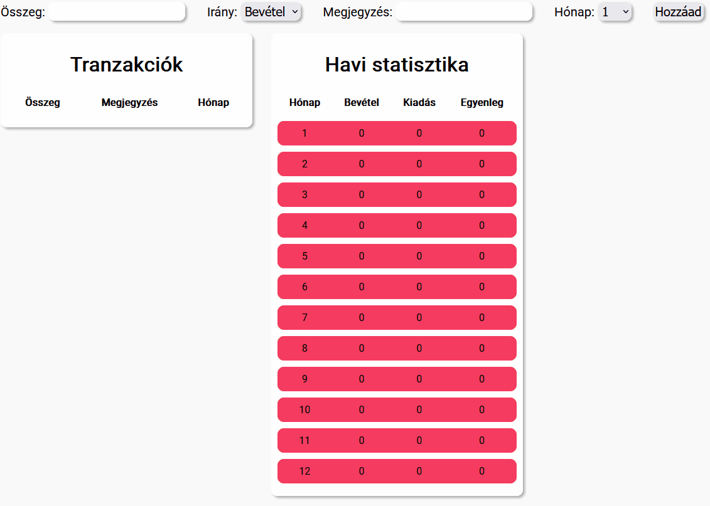
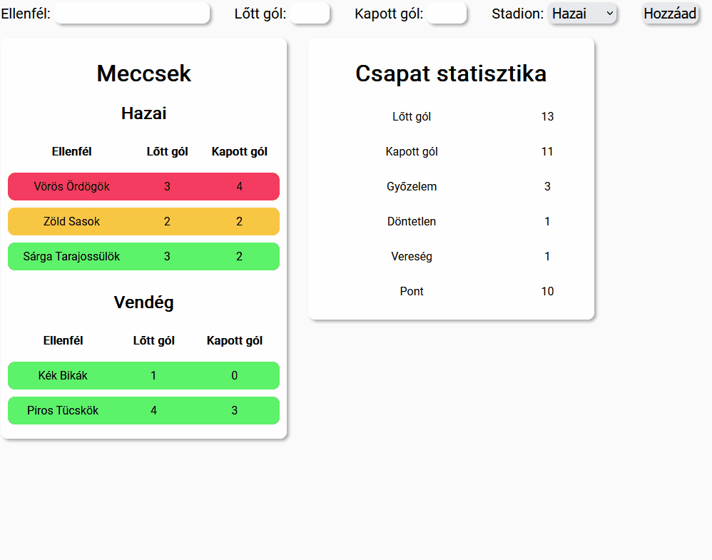
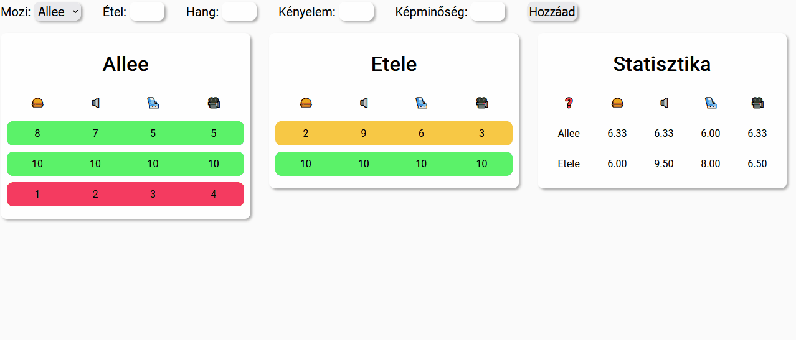

# Csoportos beadandó
## Közös előkészítés
Itt már nem szedtem szét részfeladatokra. Leírom egyben a feladatot, viszont az előző csoportmunka alapján most már együtt kell megbeszélnetek és elkészítenetek a felosztást, hiszen egy-egy nagyobb projektnél sem lesz előre megadva.

## Hasznos kódrészletek
### Szám?
```PHP
is_numeric("12345");    //true
is_numeric("12345.67"); //true
is_numeric("12345,67"); //false
is_numeric("12345.AB"); //false
is_numeric("Almafa");   //false
```

### Számmá alakítás
```PHP
// Beépített függvénnyel
(intval("12345"));      //12345
(intval("12345.67"));   //12345
(intval("12345,67"));   //12345
(intval("12345.AB"));   //12345
(intval("12345AB") );   //12345
(intval("A12B345") );   //0
(floatval("12345.67")); //12345.67
(floatval("12345,67")); //12345

// Konverzióval
(int)"12345";       // 12345
(int)"12345.67";    // 12345
(int)"12345,67";    // 12345
(int)"12345.AB";    // 12345
(int)"12345AB";     // 12345
(int)"A12B345";     // 0
(double)"12345.67"; // 12345.67
(double)"12345,67"; // 12345
```

### Egész?
```PHP
intval("12345") == floatval("12345");    // true
intval("12345") == floatval("12345.67"); // false
```

### Tizedes kerekítés
```PHP
number_format(123.456, 0); // "123"
number_format(123.456, 1); // "123.4"
number_format(123.456, 2); // "123.45"
number_format(123.456, 3); // "123.456"
number_format(123.456, 4); // "123.4560"
```

### Objektumok tömbjéhez új elem fűzése
```PHP
$elements = [
    (object)[
        "name" => "Áron",
        "age" => 22
    ],
    (object)[
        "name" => "Nándor",
        "age" => 21
    ]
];

$elements[] = (object)[
    "name" => "Gergő",
    "age" => 25
]
```

## Bank
A feladat egy banki alkalmazás elkészítése, mely tranzakciókat kezel. A tranzakcióknak négy tulajdonsága van:
- Összeg: pozitív szám, ami az összeget tárolja;
- Irány: valamilyen módon tárolja, hogy ez a tranzakció bevétel vagy kiadás;
- Megjegyzés: tetszőleges megjegyzés a tranzakcióhoz;
- Hónap: egész szám 1-től 12-ig, a hónap sorszámát tárolja, amikor a tranzakció megtörtént.

### Listázás
- Listázzátok ki a tranzakciókat valamilyen módon.
- A listázás történjen egy táblázatba, ahol fel van tűntetve az összegük, a megjegyzés és a hónap.
- A bevételek legyenek zöldek, a kiadások pirosak.

### Hozzáadás
- Lehessen új tranzakciót hozzáadni valamilyen módon.
- A hozzáadás űrlappal történjen.
- Ha hibás értéket adunk meg, az ne kerüljön elmentésre:
    - nincs megadva valamelyik paraméter;
    - az összeg nem értelmezhető számként;
    - a hónap nem esik bele az \[1,12\] intervallumba.

### Statisztika
- A statisztika listázza, hogy egyes hónapokban:
    - mennyi bevételünk volt;
    - mennyi kiadásunk volt;
    - mennyi az egyenlegünk;
    - a pozitív egyenlegű hónapok legyenek zöldek, a nullások és negatívok pedig pirosak.



## Foci
A feladat egy focis alkalmazás elkészítése, mely meccseket kezel. A meccseknek négy tulajdonsága van:
- Ellenfél: ki ellen játszott a csapat;
- Lőtt gól: egész szám, a lőtt gólok számát adja meg;
- Kapott gól: egész szám, a kapott gólok számát adja meg;
- Stadion: hazai vagy vendég meccs volt.

### Listázás
- Listázzátok ki a meccseket valamilyen módon.
- A listázás történjen táblázatba, ahol látszik az ellenfél, illetve a lőtt és kapott gólok száma.
- A listázás történjen két táblázatba szétszedve aszerint, hogy hazai vagy vendég meccs volt.
- A győzelmek legyenek zöldek, a döntetlenek sárgák, a vereségek pirosak.

### Hozzáadás
- Lehessen új meccset hozzáadni valamilyen módon.
- A hozzáadás űrlappal történjen.
- Ha hibás értéket adunk meg, az ne kerüljön elmentésre:
    - nincs megadva valamelyik paraméter;
    - a gólok nem értelmezhetők számként;
    - a stadion nem hazai vagy vendég.

### Statisztika
- A statisztika listázza, hogy a csapatnak összesen hány:
    - lőtt gólja;
    - kapott gólja;
    - győzelme (3 pont);
    - döntetlenje (1 pont);
    - veresége (0 pont);
    - pontja van.



## Mozi
A feladat egy mozis alkalmazás elkészítése, mely értékeléseket kezel. Egy értékelés öt részből áll
- Mozi: az Allee vagy az Etele moziba mentünk;
- Étel, hang, kényelem, képminőség: az adott kategóriára adott egész pont \[1,10]

### Listázás
- Listázzátok ki az értékeléseket valamilyen módon.
- A listázás történjen egy táblázatba, ahol látszik mind a négy kapott pont.
- A listázás történjen két táblázatba szétszedve aszerint, hogy melyik moziba mentünk.
- A 25 összpont feletti értékelések legyenek zöldek, a 15 összpont felettiek sárgák, az annál kisebbek pirosak.

### Hozzáadás
- Lehessen új értékelést hozzáadni valamilyen módon.
- A hozzáadás űrlappal történjen.
- Ha hibás értéket adunk meg, az ne kerüljön elmentésre:
    - nincs megadva valamelyik paraméter;
    - az értékelések nem értelmezhetők számként;
    - a mozi nem az Allee vagy az Etele.

### Statisztika
- A statisztika listázza, hogy a moziknak egyenként mennyi az átlag pontjuk adott kategóriákban.
- Az átlag értékelés két tizedes jegy pontossággal legyen megadva.

